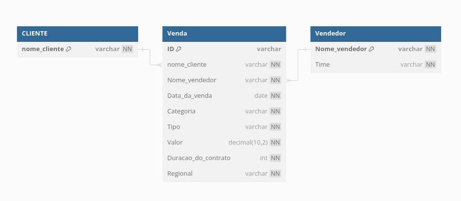

# Execução do desafio de SQL da triggo.ai

## Explicações iniciais
Para este desafio escolheu-se utilizar python aliado a pandas para fazer a leitura do CSV e manipulações deste dados

Para uma melhor visualização dos dados e gráficos, escolheu-se a interface gráfica streamlit, por conta da sua facil implementação, onde com poucas linhas consegue-se plotar gráficos e dataframes em uma interface web amigavel e interativa, e também por experiências passadas nele. A escolha de uma interface web e não de um .py ou .ipynb deu-se por conta da possibilidade de alguem que não saiba programação queira visualizar os dados, assim um arquivo de código iria dificultar a visualização por essa pessoa, enquanto a iterface web qualquer um sabe utilizar, caso a mesma esteja publicada em um server

Já para a parte de SQL preferiu-se o PostgreSQL aliado ao psycopg2, optou-se por utilizar o psycopg2 ao invés de arquivos .sql, por conta da interface do streamlit, como a mesma é programada em python, realizar as querys e crações de tabela utilizando psycopg2 ao invés de arquivos sql iria facilitar a implementação desta interface, porem ainda é utilizado linguagem SQl nesta biblioteca

[Vídeo demonstração da interface funcionando](https://youtu.be/Ym9KT_5OhyY)

## Instações dos requisitos

Primeiramente é necessario ter o python instalado, onde no [site oficial](https://www.python.org/downloads/) já realizara o download baseado no seu SO

Após isto é necessario ter o PIP para poder instalar as bibliotecas necessarias.

- Instalação PIP em distros baseadas no Debian
```bash
sudo apt install python-pip
```
- Instalação PIP em distros baseadas no ARCH
```bash
sudo pacman -Syu python-pip
```

Como o SQL será rodado localmente é necessario instalar o mesmo na maquina

- Instalação PostgreSQL distros baseadas no Debian:
```bash
sudo apt install postgresql
```
- Instalação PostgreSQL em distros baseadas no ARCH
```bash
sudo pacman -S postgresql
```

após estes passos é necessario ir para a raiz do projeto para criar um ambiente virtual e instalar as dependencias

- Entrando na raiz do projeto:
```bash
cd desafio_sql
```
- Criando um ambiente virtual
```bash
pip install virtualenv
python -m venv <virtual_enviroment_name>
```
- Ativando o ambiente virtual
```bash
source <virtual_enviroment_name>/bin/activate
```
- ex:
```bash
python -m venv venv
source venv/bin/activate
```
- Instalando as dependencias:
```bash
pip -r requirements.txt
```

## Configurando o PostdegreSQL

Ao instalar o Postdegre o mesmo vem sem nenhum usuario ou database configurado, sendo assim necessario realizar estas configurações

- Criando usuario
```bash
sudo -u postgres createuser <username>
```
- Criando databse
```bash
sudo -u postgres createdb <dbname>
```
- Criando uma senha
```bash
sudo -u postgres psql
alter user <username> with password '<password>';
\qd
```
- Dando os privilegios necessario
```bash
sudo -u postgres psql
grant all privileges on database <dbname> to <username> ;
\qd
```
```bash
psql -U postgres -d <dbname>
GRANT ALL PRIVILEGES ON SCHEMA public TO <username>;
GRANT CREATE ON SCHEMA public TO <username>;
```

estas informações, dbname, username e password estão no arquivo main.py dentro da função connect(), então será necessario alterar a mesma conforme os nomes dados

```python
conn = psycopg2.connect(host = 'localhost',
                        database = '<dbname>',
                        user = '<username>',
                        password = '<password>',
                        port = '5432')
```

Tudo configurado, está pronto para rodar o código
- Rodando o código
```bash
streamlit run main.py
```

## Atividades e códigos desenvolvidos

### main

Na main.py é feito a conexão com o PostdegreSQL além da geração da interface utilizando a biblioteca streamlit, os plots dos gráficos também foram feito via streamlit, ao ivés de bibliotecas famosas como pyplot, plotly, matplotlib, etc... Por conta da facilidade de plotar os gráficos interativos direto na interface.

Aqui também é carregado os dados do csv via pandas que serão utilizados na task de CSV


### CSV Tasks

As tasks da primeira parte(em csv) podem ser resolvidas pelas funções presentes no arquivo csv_tasks.py

 - Formatando as colunas

A seguinte função:
 ```python
def formating_columns(data):
```
Irá formatar algumas colunas do nosso dataframe para poder realizar as operações, formatações estas que são: 
1. Transformar o Valor de compra em float, mudando de R$ X.XXX,XX para XXXX.XX.
2. Transformar a coluna Duração do Contrato (Meses) em int
3. Transformar a coluna Data da Venda em datetime

- Construa uma tabela auxiliar que sumarize o valor vendido por cada vendedor, ordenando do maior para o menor
  
A seguinte função irá realizar esta task:
```python
def sumarize_sellers(data):
```
Onde a mesma irá somar as vendas de cada vendedor e retornar uma tabela com nome dos vendedores e valor vendido por ele,  ordenada em ordem decrescente em relação ao valor de vendas. A coluna 'Valor' estára formatada de volta no formato R$ X.XXX,XX.

A função retorna o nome do vendedor e o valor total vendido por ele

- Imprima e identifica qual foi o cliente responsável pela venda com maior valor e com menor valor;

A seguinte função irá realizar esta task:
```python
def best_and_worst_client(data):
```
Onde a mesma irá verificar qual o maior e menor numero da coluna `valor`  e retornar um dataframe filtrado apenas para venda de maior e menor valor, optou-se por fazer isto e não imprimir apenas o nome dos clientes, para poder plotar na interface streamlit. A coluna 'Valor' estára formatada de volta no formato R$ X.XXX,XX

- Imprima valor médio por Tipo de venda (Serviços, Licenciamento, Produtos)

A seguinte função irá realizar esta task:
```python
def type_sales_mean(data):
```
Onde a mesma agrupa os valores por tipo, e após isto realiza a média entre eles e após isto ordenando em ordem decrescente em relação ao valor de vendas. A coluna 'Valor' estára formatada de volta no formato R$ X.XXX,XX;

A função retorna um dataframe com o Tipo  e o valor médio de venda

- Imprima o número de vendas realizada por cliente;

A seguinte função irá realizar esta task:
```python
def sales_per_client(data):
```
Onde a mesma é responsavel por contar quantas compras cada cliente fez.

A função retorna um dataframe com o nome do cliente e quantas compras o mesmo realizou

### SQL Tasks
- Construa o modelo de relacionamento com as categorias utilizadas em todos os campos do arquivo CSV (colocar imagem);

Abaixo temos o print modelo de relacionamento dos campos do CSV, modelo este feito através do site [https://dbdiagram.io/d](https://dbdiagram.io/d)


- Criação das tabelas

Antes das realizações das tasks em si, foi feita a criação das tabelas sql atravez da função
```python
def create_tables(conn):
```

Onde a mesma ira criar as tabelas demonstradas na imagem, utilizando a biblioteca psycopg2

- Adicionando os dados na tabela

Após a criação das tabelas foi necessario adicionar os dados do csv nelas, e isto foi realizado pela função:
```python
def insert_data(conn, data):
```

-  Listar todas as vendas (ID) e seus respectivos clientes apenas no ano de 2020

A seguinte função irá realizar esta task:
```python
def get_sales2020(conn):
```
Onde utilizando pandas aliado a psycopg2 a mesma ira retornar uma tabela(dataframe) contendo o ID da venda feita em 2020 e o nome do cliente que realizou a compra

- Listar a equipe de cada vendedor

A seguinte função irá realizar esta task:
```python
def get_team(conn):
```
Onde utilizando pandas aliado a psycopg2 a mesma ira retornar uma tabela(dataframe) com o nome do vendedor e seu respectivo time

- Construir uma tabela que avalia trimestralmente o resultado de vendas e plote um gráfico deste histórico.

A seguinte função irá realizar a parte de construir a tabela:
```python
def get_quarter_sales(conn):
```

Onde a mesma irá construir uma tabela com o valor vendido naquele trimestre, e o trimestre correspondende ao valor.
O plot do gráfico é feito na main.py, pelo código
```python
st.line_chart(quarter_sales, x='trimestre', y='vendas_totais')
```
